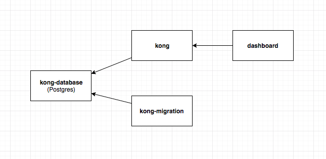

# Kong with Docker-Compose

An example how to use Kong with Docker compose.

There are 4 services in this example:
- **kong**: API Gateway
- **kong-migration**: self-terminated container, is used to only migrate database for Kong.
- **kong-database**: Postgres database *(Kong supports Postgres and Cassandra)*
- **dashboard**: Kong GUI

And here is a dependency direction between each of these services:

<a href="./dependency-direction.png" target="_blank">  
  
</a>


- **"kong-database"** is the only service that has on dependencies on other services
- **"kong"** and **"kong-migration"** will depend on **"kong-database"**
- **"dashboard"** depends on **"kong"**

We set restarting policy on "kong" service to "always" because this service depends on migration status on "kong-database" that is handled by "kong-migration" that is a self-terminated service that will be removed after finish execution, so "kong" can not depend on "kong-migration".


I also seperate these 4 services into 3 docker-compose files like this:
- docker-compose.yaml: base file that run "kong-database" service
- docker-compose.setup.yaml: contains "kong-migration" service for migrating "kong-database" service
- docker-compose.dev.yaml: contains "kong" and "dashboard" services

### To run these compose files:

- For migration step
````
docker-compose -f docker-compose.yaml -f docker-compose.setup.yaml up -d
````

- For running Kong API gateway
````
docker-compose -f docker-compose.yaml -f docker-compose.dev.yaml up -d
````

### Todo:
- Integrate [Kongfig](https://github.com/mybuilder/kongfig) to setup upstream services.
- Create Makefile to run docker-compose